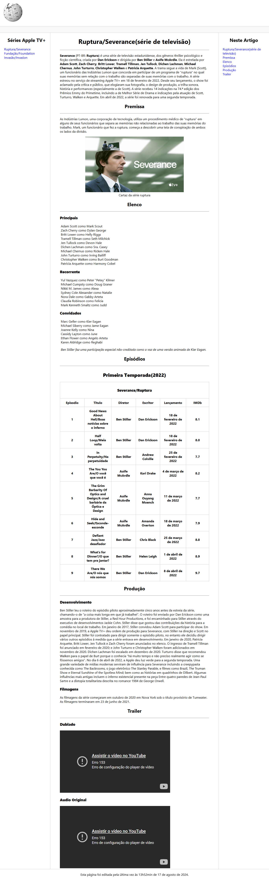

# 📚 Estudos em HTML

Este projeto foi desenvolvido como parte dos meus estudos em **HTML5**, com o objetivo de praticar estruturação de páginas, hierarquia de conteúdo, tabelas, listas, links, iframes, uso de imagens e organização semântica básica.

---

## 🛠️ Tecnologias Utilizadas
- **HTML5**
- **CSS3**
- Estruturação semântica básica
- Tabelas (`<table>`)
- Navegação por âncoras (`#id`)
- Inclusão de imagens (``)
- Inclusão de vídeos com **iframe**
- Organização em sidebar e conteúdo principal

---

## 📄 Conteúdo da Página

O projeto HTML contém:

### ✔️ Cabeçalho
- Logo  
- Barra de separação  
- Navegação lateral com links para séries da Apple TV+

### ✔️ Conteúdo Principal
- **Título e introdução** sobre a série  
- **Premissa**  
- **Imagem oficial** com `<figure>` e `<figcaption>`  
- **Elenco completo**, dividido em:
  - Principais  
  - Recorrentes  
  - Convidados  

### ✔️ Tabela de Episódios
Tabela organizada com:
- Número
- Título
- Diretor
- Escritor
- Data de lançamento
- Nota IMDb

### ✔️ Produção
- Desenvolvimento  
- Influências  
- Filmagens  

### ✔️ Trailers
- Trailer **dublado**  
- Trailer **em áudio original**  

### ✔️ Navegação por Âncoras
Uma coluna lateral com links rápidos para cada sessão do artigo.

---

## 🎯 Objetivo
Este projeto foi criado para:

- Praticar **estrutura HTML avançada**
- Aprender a organizar conteúdo longo
- Criar tabelas acessíveis e informativas
- Usar âncoras para navegação interna
- Treinar organização visual básica antes de aplicar CSS avançado ou responsividade

---

## 📷 Prévia do Projeto
 

---

## 📌 Próximos Passos (opcional)
- Tornar o layout **responsivo**
- Melhorar estilização com CSS
- Criar um sistema de navegação mais elaborado
- Implementar versão com **semântica HTML mais avançada**
- Adicionar modo escuro (dark mode)

---

## 📄 Licença
Projeto criado apenas para fins educacionais.  
Sinta-se livre para estudar e modificar como quiser.

---

✦ Desenvolvido por **Willian Matheus**  
Se quiser, posso gerar também:

